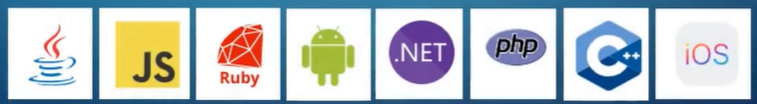

# Gherkin - The Master Guide

## Behavioral Driven Development (BDD)

What is BDD?

- Encourages Collaboration Across Roles
- Help obtain shared understanding of problem
- Small rapid iterations to get feedback
  - This helps developers to respond to any feedback from users
- Produce documentation matching system behavior

## What is Cucumber and what is Gherkin?

#### What is Cucumber?
- Cucumber is an open source software tool that supports Behavior Driven Development
- It offers ways to write scenarios and tests so that anyone can understand them, even without technical knowledge.
- Acceptance tests are written, which describe the behavior of the system being tested from a business perspective before the developers write any code. 
- It's available in many languages and just a few are shown here, but there are many more implementations. 

#### What is Gherkin?
- What is Gherkin in relation to Cucumber?
  - Cucumber writes acceptance tests and scenarios in an English like language, using certain keywords with a particular syntax.
  - This simple English like text is called the Gherkin Language
  - Because Gherkin is in a certain syntax with known keywords, it can be parsed and understood by the Cucumber software in order to validate these scenarios and test the software against the acceptance criteria. 

## Why Learn Gherkin?
- Gherkin is an integral part of Behavior Driven Development and Cucumber as well. You will need to learn Gherkin if you want to use Cucumber.
- Gherkin language is widely used by testing professionals, especially when building automated tests. 
- Also used by business analysts in the industry for documenting business requirements, and user stories. 
- Lastly a great skill to learn, and add to your resume. 

## Gather business requirements with Gherkin
In many companies, the gathering of requirements for a product or a service is conducted in a very informal and undisciplined manner. 

Ways that requirements are often gathered:

- Brainstorming and whiteboard sessions. Could be quite informal, just basically gathering people's thoughts on a whiteboard. 
- Formal meetings:  
  - Most usual way that requirements are gathered in a business, with all the members getting together.
- At desk casual chats:
  - When colleagues come up to us and to have an impromptu conversation with some ideas

